# Credential Exchange

This document describes a generic HTTP duplex (client-server) verifiable credential issuance flow.

## Issuance Flow

Points of notes:
- The issuing `ssi-hub` must be able to authorize the approval of the credential issuance request
- The requester `ssi-hub` can be removed if credential applications and issued credentials can be stored locally
(if using a mobile wallet instead of a web wallet, for example)

Deviations from current SB->ssi-hub flow:
- Currently SB prepares credential application from credential governance definition directly

Can we issue directly from the SSI Hub somehow? -> would be nice to be able to pre-fill a VC

### Standard vs Custom Endpoints

#### Issuer SSI Hub

| Purpose | Standard | Client Party | Spec Link
| --- | --- | --- | --- |
| Issue Credential | Yes | Issuer | https://w3c-ccg.github.io/vc-api/#issue-credential
| Initiate Exchange | Yes | Holder | https://w3c-ccg.github.io/vc-api/#initiate-exchange
| Continue Exchange | Yes | Holder | https://w3c-ccg.github.io/vc-api/#continue-exchange
| Query Submissions | No | Issuer | 
| Submit Processing Result | No | Issuer

### Credential Exchange Flow Diagram

The following is a sequence diagram of an credential exchange flow.
This flow can be either a credential verification exchange (an exchange between a holder and a verifier) or a credential issuance exchange (an exchange between an issuer and a verifier).

```mermaid
sequenceDiagram
  actor R as Holder
  participant RSH as Holder SSI Hub
  participant RSB as Web UI
  participant ISH as Verifier SSI Hub
  participant IService as Verification Service
  participant CD as Credential Definition Repository

  rect rgb(243, 255, 255)
  note right of R: initiate exchange
    R->>RSB: provide exchange url (e.g. from QR code or link)
    RSB->>ISH: initiate credential exchange

    activate ISH
    alt using local Exchange Definition
      ISH->>ISH: 
    else using Credential Governance Definition
      ISH->>CD: retrieve Credential Definition
    end
      ISH-->>RSB: return VP request
    deactivate ISH
  end

  rect rgb(255, 243, 255)
  note right of R: submit credential application
    RSB->>R: display required presentation data
    R-->>RSB: enter required input and/or select credentials
    RSB->>R: request credential application (presentation) signature
    R-->>RSB: approve signature
  end
  
  rect rgb(255, 255, 235)
  note right of R: process presention
  alt mediated presention processing
    RSB->>ISH: submit presentation 
    activate ISH
      ISH->>ISH: Verify presentation signatures and satisfaction of credential query
      ISH-->>RSB: reply with "mediation in progress" VP Request
    deactivate ISH

    par review presentation
      ISH->>IService: notify verification service of new presentation
      IService->>ISH: query outstanding presentations to review
      activate ISH
        ISH-->>IService: return presentation to review
      deactivate ISH
      IService->>IService: process presentation
      opt credential issuance
        IService->>IService: prepare & issue VCs (as a VP)
      end
      IService->>ISH: submit presentation processing result (possibly including VCs)
    and query presentation status
      R->>RSB: query presentation submissions 
      RSB->>RSH: query outstanding presentations
      RSB->>ISH: query presentation review status
      alt presentation is processed
        ISH-->>RSB: return review result (possibly including VP with VC)
      else application not yet process
        ISH-->>RSB: return "mediation in progress" VP Request
      end
      
    end
    RSB->>RSH: store VC
    RSB-->>R: display issued credential to requester
  else unmediated application processing
    RSB->>ISH: submit credential application to issuer hub
    activate ISH
      ISH->>ISH: Verify presentation signatures and satisfaction of credential query
      ISH-->>RSB: return review result 
    deactivate ISH
  end
  end
```



## Exchange Definitions

Energy Web is in the process of developing an object schema by which an Exchange Definition can be specified to `ssi-hub`.
(See https://github.com/energywebfoundation/ssi/pull/31 for more details)

An example Exchange Definition is an shown.
```json
{
  // "exchangeId" identifies the exchange at the server (https://w3c-ccg.github.io/vc-api/#initiate-exchange)
  "exchangeId": "permanent-resident-card-presentation",
  // "query" defines what information should be required from the requester (https://w3c-ccg.github.io/vp-request-spec/#query-types)
  "query": [
    {
      "type": "PresentationDefinition",
      "credentialQuery": [{
        ...some presentation definition
      }]
    }
  ],
  // "interactServices" defines where a credential exchange can be initiated (https://w3c-ccg.github.io/vp-request-spec/#interaction-types)
  "interactServices": [
    {
      "type": "UnmediatedHttpPresentationService2021",
      "baseUrl": "http://localhost:3000"
    }
  ]
}
```
```json
{
    // "exchangeId" identifies the exchange at the server (https://w3c-ccg.github.io/vc-api/#initiate-exchange)
    "exchangeId": "permanent-resident-card-issuance",
    // "query" defines what information should be required from the requester (https://w3c-ccg.github.io/vp-request-spec/#query-types)
    "query": [
      {
        "type": "DIDAuth",
        "credentialQuery": []
      }
    ],
    // "interactServices" defines where a credential exchange can be initiated (https://w3c-ccg.github.io/vp-request-spec/#interaction-types)
    "interactServices": [
      {
        "type": "MediatedHttpPresentationService2021",
        "baseUrl": "http://localhost:3000"
      }
    ]
}
```

## ENS Credential Governance Definitions

Energy Web has developed an approach which uses ENS namespaces to define credential metadata.
The ENS namespace is used as the identifier of the credential definition and the credential metadata is stored by an ENS Resolver.

Below is an example credential (role) definition that is currently returned from the EnergyWeb role system.

The credential definition currently serves several purposes:
- It defines the information that issuers should require from requestors (`fields` and `enrolementPreconditions` properties)
- It defines which identities are authorized to issue the credential (`issuer` property)
- It defines data which should be included in an issued credential (`issuerFields` property)

Additional properties which may be helpful include:
- An `interactServices` property which communicates where the credential can be requested

```json
{
  "id": 657,
  "name": "battery",
  // "namespace" is the ENS namespace of the credential definition
  "namespace": "battery.roles.assetmanagement.apps.samplecorp.iam.ewc",
  // "namehash" is the ENS namehash of the namespace
  "namehash": "0x147aa42525ed471265e8bed71cb0a903520aae1a1c337d572fd0b9d45957013b",
  // "owner" is the EWC account that is authorized to update the Credential Definition
  "owner": "0x829b91Fa3e91EA4448365ADA58C7Bad1Ff142866",
  "definition": {
    // "fields" are additional fields that a requestor must enter prior to being given a credential
    "fields": [
      {
        "label": "Voltage",
        "maxValue": 10,
        "minValue": 5,
        "required": null,
        "fieldType": "number"
      }
    ],
    "presenationDefinition: []
    // "issuer" defines which DIDs are allowed to read 
    "issuer": {
      "did": [
        "did:ethr:volta:0x829b91Fa3e91EA4448365ADA58C7Bad1Ff142866"
      ],
      "issuerType": "DID"
    },
    "version": 1,
    "roleName": "battery",
    "roleType": "app",
    // "issuerFields" 
    "issuerFields": [
      {
        "label": "Serial Number",
        "pattern": null,
        "required": null,
        "fieldType": "text",
        "maxLength": 20,
        "minLength": 3
      }
    ],
    // "enrolmentPreconditions" are credentials that a requestor must provide
    "enrolmentPreconditions": [
      {
        "type": "role",
        "conditions": [
          "manufactured.roles.assetmanagement.apps.samplecorp.iam.ewc"
        ]
      }
    ]
  }
}
```