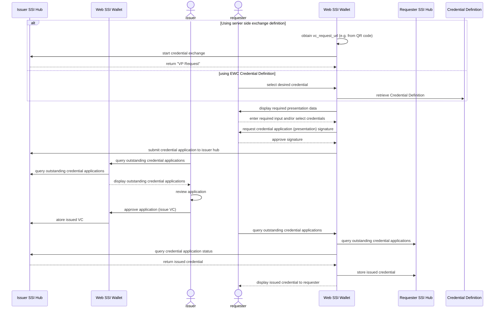

```mermaid
sequenceDiagram
    participant ISH as Issuer SSI Hub
    participant ISB as Web SSI Wallet
    actor I as issuer
    actor R as requester
    participant RSB as Web SSI Wallet
    participant RSH as Requester SSI Hub
    participant CD as Credential Definition
    

  alt Using server side exchange definition
    RSB->>RSB: obtain vc_request_url (e.g. from QR code)
    RSB->>ISH: start credential exchange
    ISH-->>RSB: return "VP Request"
  else using EWC Credential Definition
    R->>RSB: select desired credential
    RSB->>CD: retrieve Credential Definition
  end
    RSB->>R: display required presentation data
    R-->>RSB: enter required input and/or select credentials
    RSB->>R: request credential application (presentation) signature
    R-->>RSB: approve signature

    RSB->>ISH: submit credential application to issuer hub
    I->>ISB: query outstanding credential applications
    ISB->>ISH: query outstanding credential applications
    ISB-->>I: display outstanding credential applications
    I->>I: review application
    I->>ISB: approve application (issue VC)
    ISB->>ISH: atore issued VC

    R->>RSB: query outstanding credential applications
    RSB->>RSH: query outstanding credential applications
    RSB->>ISH: query credential application status
    ISH-->>RSB: return issued credential
    RSB->>RSH: store issued credential
    RSB-->>R: display issued credential to requester
```
