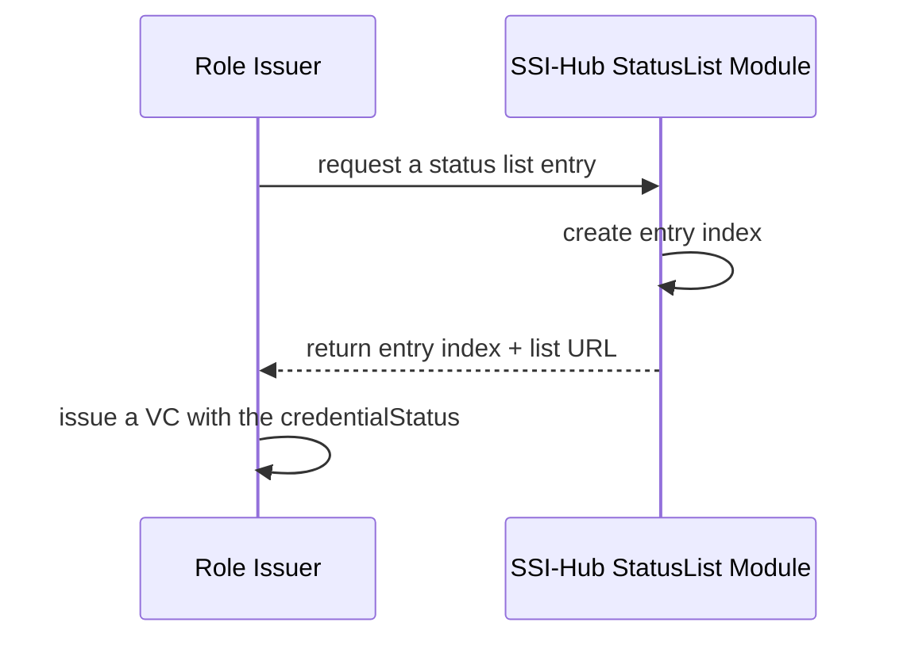
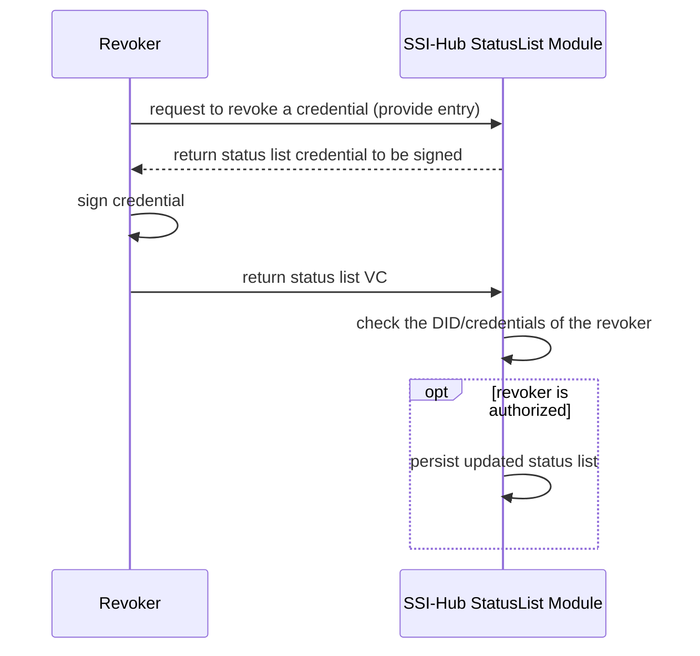
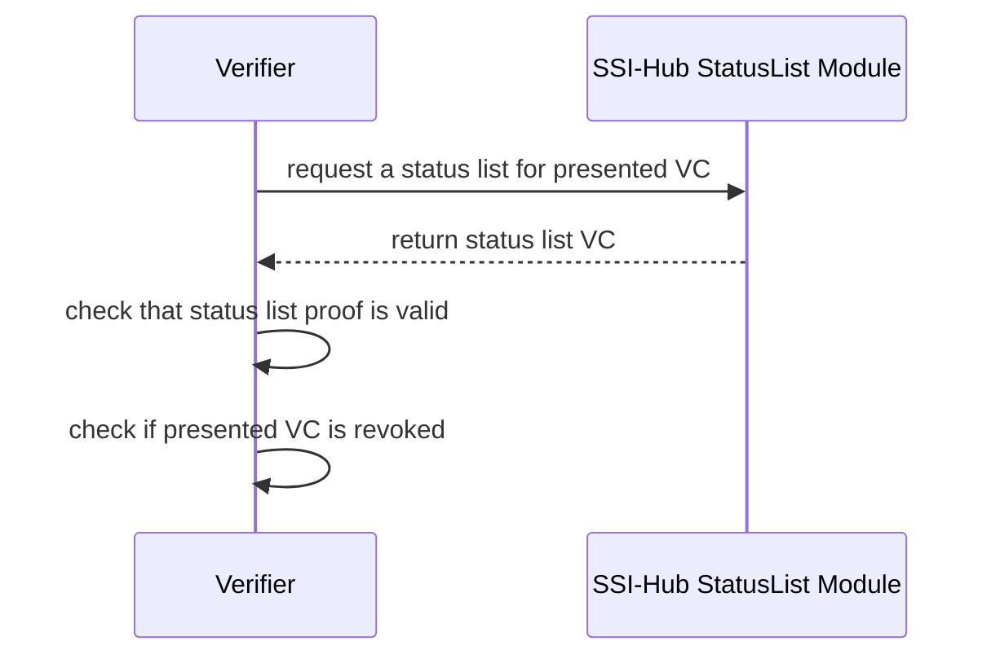
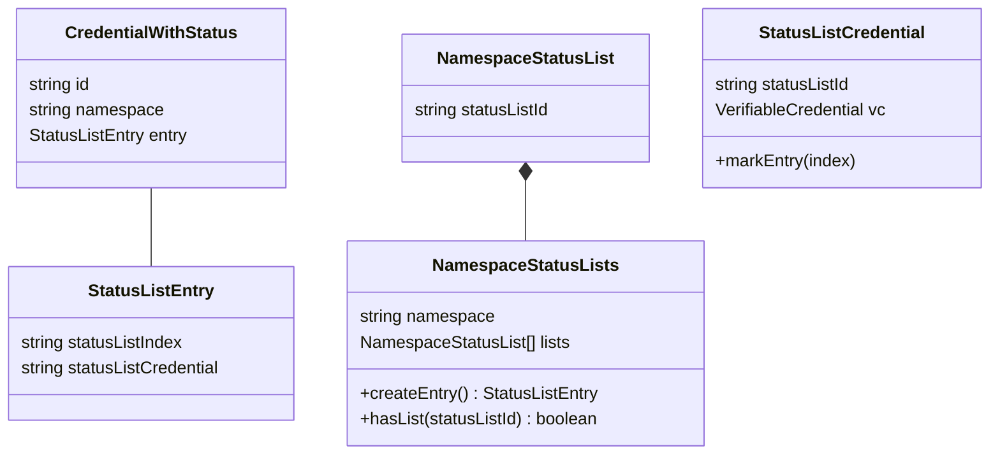

# Revocation

## StatusList2021

https://w3c-ccg.github.io/vc-status-list-2021/ 

### StatusList2021 Sequences

#### Issue credential


#### Revoke a credential


#### Verify a credential


### Design Challenges

#### StatusList Credential should have an issuer or proof
https://w3c-ccg.github.io/vc-status-list-2021/#example-example-statuslist2021credential-0

This has the benefit that ssi-hub can not unilaterally forge revocation lists.
This means that we must get a signature from revoker.

**Problem**:
It only makes sense for a revoker to sign a list that they are authorized to sign.
We couldn't have just one list in SSI Hub, for example.
We need to check the authority of the revoker and it may not be clear who the revoker is.

Solution:
- We could have one list per role definition/namespace.
  - Revoker A revokes credential A on list 1 (signing list 1).
  Revoker B then revokes credential B on list 1 (signing list 1).
  Revoker B therefore also signing the previous revocation of Revoker A (in addition to their new revocation).
  *This is acceptable as long as Revoker B trusts what Revoker A has done*.
  - This approach allows bulk revocation of credential of the same role

Other possible solutions:
- Have a 1to1 mapping of StatusListCredential to VC.
  - This elimates the [herd privacy benefits of StatusList2021](https://w3c-ccg.github.io/vc-status-list-2021/#introduction)
  - If decentralized storage was used, privacy could be restored?
  - In this case the issuer of the StatusListCredential is the revoker

**Problem**:
The issuer can't necessarily sign the StatusList2021 Credential

Solution:
- The status list isn't created until revocation. 
  - SSI-Hub could define the URL but the URL could return an `empty` (e.g. 204 No Content) status code if no revocations

Other possible solutions:
- Verifier can expect that issuer's can sign the list **if the revocation's are empty**

**Problem**: Verifying that revoker is valid could require a credential

Solution: As currently done with issuance, we require that revoker's publish their credential publicly (e.g. to IPFS) in order to revoke and in order for their revocations to be verifiable

## Entities

### Aggregate Roots
#### NamespaceStatusLists

`NamespaceStatusLists` is the aggregate root that manages the allocations of status list entries for a given namespace and associates a status list with a given namespace.

#### StatusListCredential

`StatusListCredential` maps a status list id to the actual [StatusList2021Credential](https://w3c-ccg.github.io/vc-status-list-2021/#statuslist2021credential).

The actual VC is in a separate aggregate root from the status list id to namespace association in order to have tighter consistency boundaries:
- During entry allocation, one needs knowledge of the entries across a namespace.
One needs to answer the question: "Is there an open entry in the status lists of the namespace?" 
- During entry update, one only needs knowledge of updates across a given status list.
One needs to answer the question: "Can I apply an update to this status list?"

#### CredentialWithStatus

`CredentialWithStatus` represents a credential with a StatusList2021
[credentialStatus](https://www.w3.org/TR/vc-data-model/#status) property.
`CredentialWithStatus` is a separate aggregate root in order to more easily enforce the unique constraint of the `CredentialWithStatus.id`.

`CredentialWithStatus.statusListCredential` corresponds to `StatusListCredential.statusListId` and `NamespaceStatusList.statusListId`.
This is in line with the `id` property guidance for [StatusList2021Credential](https://w3c-ccg.github.io/vc-status-list-2021/#statuslist2021credential).

If the association of a credential to an entry is located within
the `NamespaceStatusLists` aggregate root, then is is not possible to efficiently search for a credential.
In other words, if needed to look across all of the `NamespaceStatusLists` for a credential, then one would need to lock updates across all namespaces to be sure that a data wasn't inserted during the search.

### Class Diagram



## Pseudocode

### Getting entry for issuance

```
const namespaceStatusLists = service.getNamespaceStatusLists(namespace)
const entry = namespaceStatusLists.createEntry()
const credential = new CredentialWithStatus(id, entry, namespace) 
```

Note that `createEntry` and the creation of `CredentialWithStatus` are in sequence.
So, a claimed `entry` may failed to be associated with a `CredentialWithStatus`.
However, as entries are inexpensive and their creation can be authorized, this is acceptable.

**TODO: update the above with a note about transactions...**

### Update entry in a status list

```
updateEntry(namespace, statusListCredential, requester) {
  const statusListId = statusListCredential.id;
  const namespaceStatusLists = namespaceStatusListRepo.findOneBy(namespace)
  if (namespaceStatusLists.hasList(statusListId) == false) {
    Error("provided namespace is incorrect for this statusList")
  }
  verifyRevocationAuth(namespace, requester);
  statusListCredentialRepository.save({
    statusListId,
    statusListCredential
  })
}
```
