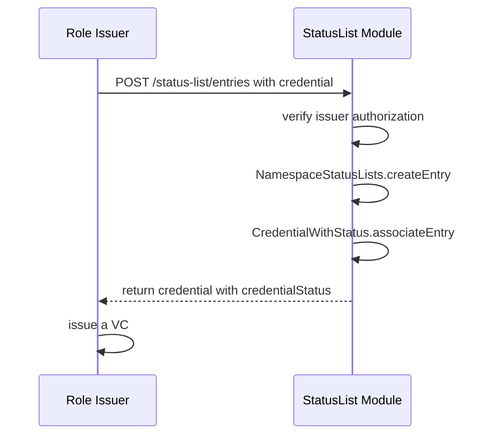
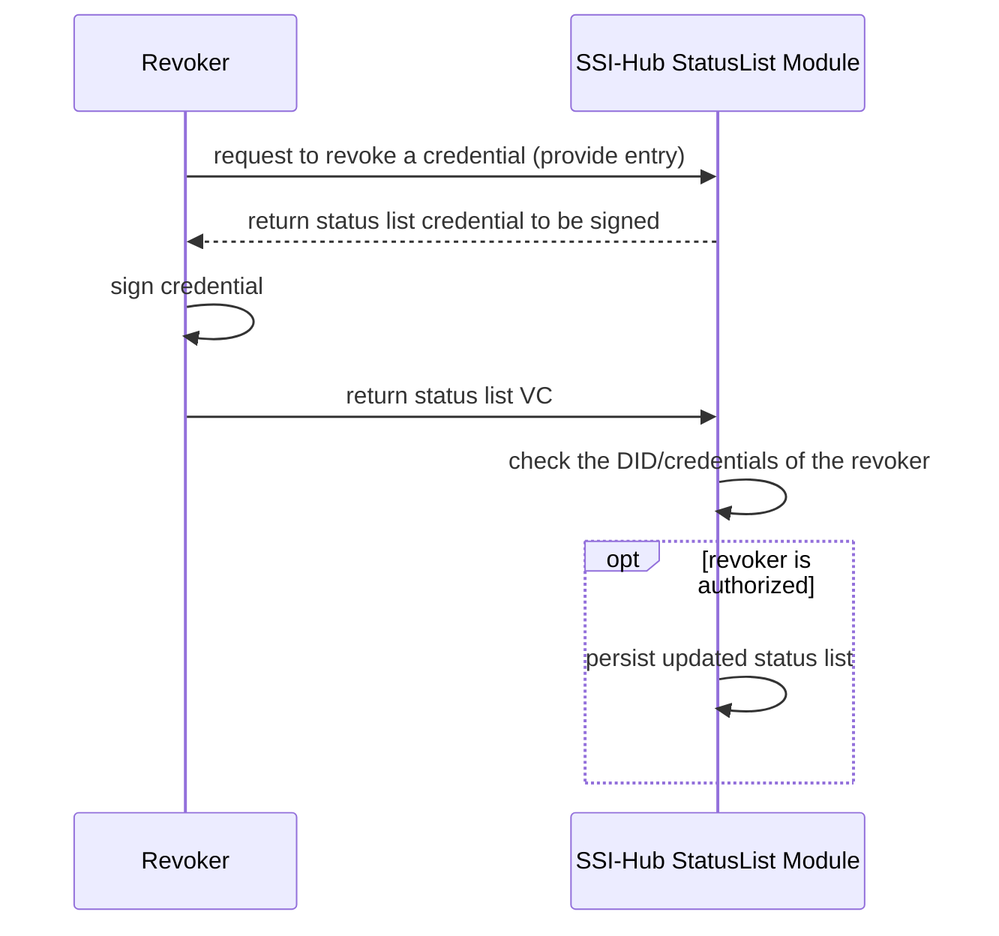
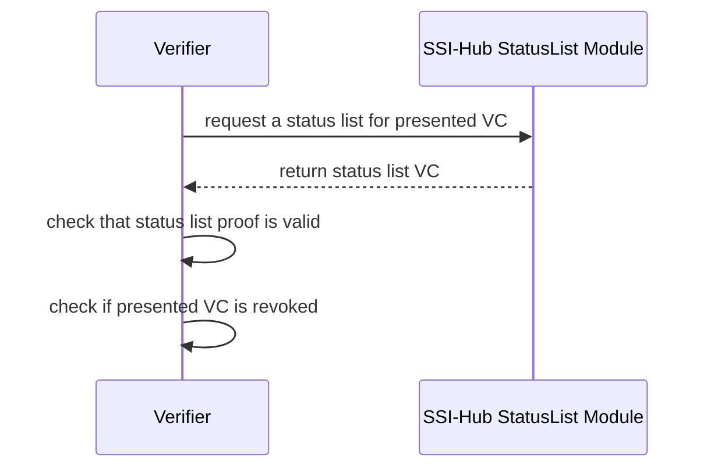
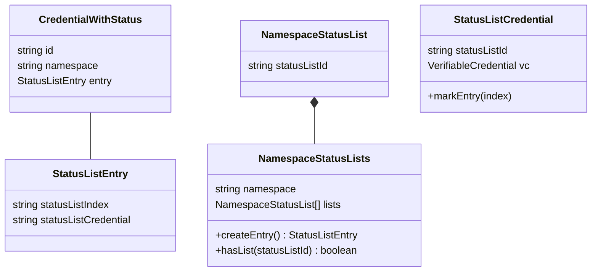

# Status-List Module

Verifiable Credentials (VCs) can have a `credentialStatus` property.
The [status-list module](../src/modules/status-list/) provides an API to enable the credential status using the [StatusList2021 specification](https://w3c-ccg.github.io/vc-status-list-2021/).

A key feature of the implementation is the use of the EnergyWeb ENS (Ethereum Name Service) Role Definitions to authorize updates to the status lists. 

## Sequences

### Issue credential

### Revoke a credential

### Verify a credential

## Key Design Challenges and Solutions

### Revocation Authorization is based on Role Definition
It only makes sense for a revoker to sign a list that they are authorized to sign.
This authorization is determined by the role definition of the role credential that a revoker is attempting to revoke.

This means that it is not feasible have just one list in SSI Hub, for example.
This is because it is not feasible that a given revoker is authorized to revoke all roles.

**Chosen solution**:

This authorization challenge is eliminated by having one list per role definition/namespace.
This allows a sequence as follows
  1. Revoker A revokes credential A on list 1 (signing list 1).
  1. Revoker B then revokes credential B on list 1 (signing list 1).
  1. Revoker B therefore also signing the previous revocation of Revoker A (in addition to their new revocation).
  *This is acceptable as long as Revoker B trusts what Revoker A has done*.

This approach allows bulk revocation of credential of the same role

### Client-side proving/signing of CredentialStatus VC
[StatusList2021Credentials](https://w3c-ccg.github.io/vc-status-list-2021/#example-example-statuslist2021credential-0) should have a proof so that verifiers can con

Due to the IAM stack's signature being client-side (performed, for example by Metamask) means that the server cannot forge status list credentials.
However this introduces challenges because the revocations cannot be performed synchronously by the server.

The challenge is as follows:

Therefore, only one revoker may update a given StatusList2021Credential at a given time.

**Chosen solution:**

Have a 1to1 mapping of StatusListCredential to VC.
  - This elimates the [herd privacy benefits of StatusList2021](https://w3c-ccg.github.io/vc-status-list-2021/#introduction) as the server providing the StatusList2021Credential can map a request to a particular held VC. 
  - Decentralized storage was used (such that the 1to1 mapped lists could be published to shared locations), it may be possible to restore holder privacy.

### Credential Issuers May Not Be Authorized Revokers 
Given EnergyWeb's Role Definition implementation, a role credential issuer may not be necessarily be authorized to prove (sign) the `StatusList2021Credential`.

**Chosen solution:**

- The status list isn't created until revocation. 
  - SSI-Hub responds to the  URL could return an `empty` (e.g. 204 No Content) status code if no revocations

Other possible solutions not chosen:
- Verifier can expect that issuers can sign the list **if the revocations are empty**

### Verifying that revoker is valid could require a credential
Role Definitions can state the a revoker must hold a given role in order to be allowed to revoke  

**Chosen solution:**

As currently done with issuance, we require that revoker's publish any credentials which are required to establish their authority publicly (e.g. to IPFS) in order to revoke and in order for their revocations to be verifiable.

## Entities (AggregateRoots)

### NamespaceStatusLists

`NamespaceStatusLists` is the aggregate root that manages the allocations of status list entries for a given namespace and associates a status list with a given namespace.

### StatusListCredential

`StatusListCredential` maps a status list id to the actual [StatusList2021Credential](https://w3c-ccg.github.io/vc-status-list-2021/#statuslist2021credential).

The actual VC is in a separate aggregate root from the status list id to namespace association in order to have tighter consistency boundaries:
- During entry allocation, one needs knowledge of the entries across a namespace.
One needs to answer the question: "Is there an open entry in the status lists of the namespace?" 
- During entry update, one only needs knowledge of updates across a given status list.
One needs to answer the question: "Can I apply an update to this status list?"

### CredentialWithStatus

`CredentialWithStatus` represents a credential with a StatusList2021
[credentialStatus](https://www.w3.org/TR/vc-data-model/#status) property.
`CredentialWithStatus` is a separate aggregate root in order to more easily enforce the unique constraint of the `CredentialWithStatus.id`.

`CredentialWithStatus.statusListCredential` corresponds to `StatusListCredential.statusListId` and `NamespaceStatusList.statusListId`.
This is in line with the `id` property guidance for [StatusList2021Credential](https://w3c-ccg.github.io/vc-status-list-2021/#statuslist2021credential).

Due to `NamespaceStatusLists` and `CredentialWithStatus` being separate aggregate roots, the design allows for a created entry which is not associated with a credential (due to a failure).
This is a possible drawback.
However the rationale for this is that if the association of a credential to an entry is located within the `NamespaceStatusLists` , then is is not possible to efficiently search for a credential based on credential `id`.
In other words, if needing to search across all of the `NamespaceStatusLists` for a credential based on its `id`, then one would need to lock updates across all namespaces to be sure that a data wasn't inserted during the search.
(All namespaces must be locked because, based on the `id` alone, the credential could be in any namespace).

*TODO: update the above with a note about transactions...*

### Class Diagram

